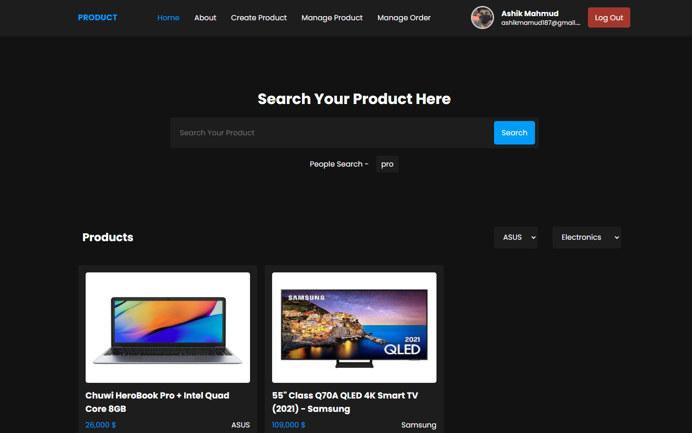

# Product Management Application.

This is product management application using React Nodejs Mongodb Express and etc. If you have any query about my project please feel free to share.

## Using Technologies

---

### Front-end

- React Js
- React Router DOM
- Firebase
- axios
- react-hook-form
- react-hot-toast
- sweetalert2

### Back-end

- cors
- dotenv
- express
- jsonwebtoken
- mongodb
- nodemon

## Required Features

---

- You can login using Facebook and google account
- You can also add your products and manage it.
- Also can delete update of your adding product
- Also can buy from the application and Outside of
- Also can search your needy products and will get the search history for recent search.

## Demo Link on [Click Here](https://product-management-c4e87.web.app/) || <https://product-management-c4e87.web.app/>

# Preview Screenshot

> Thanks for reach out me on github.
